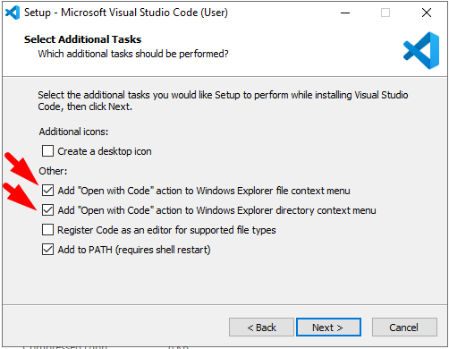
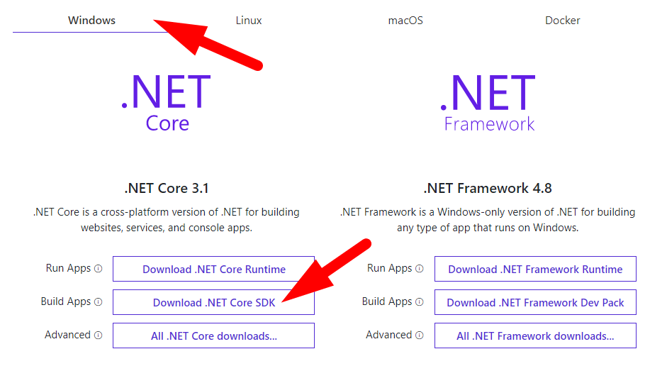
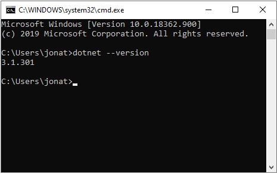
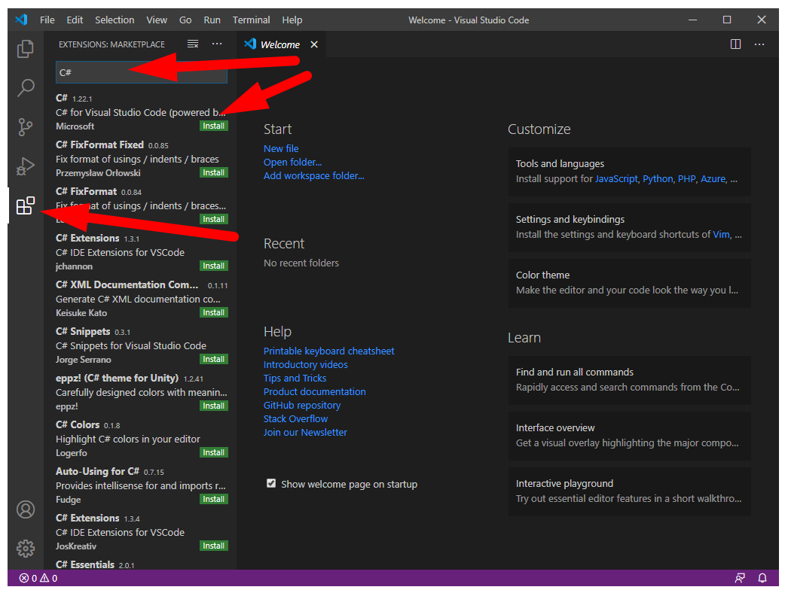
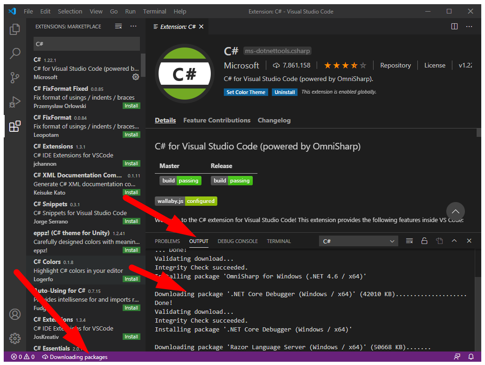
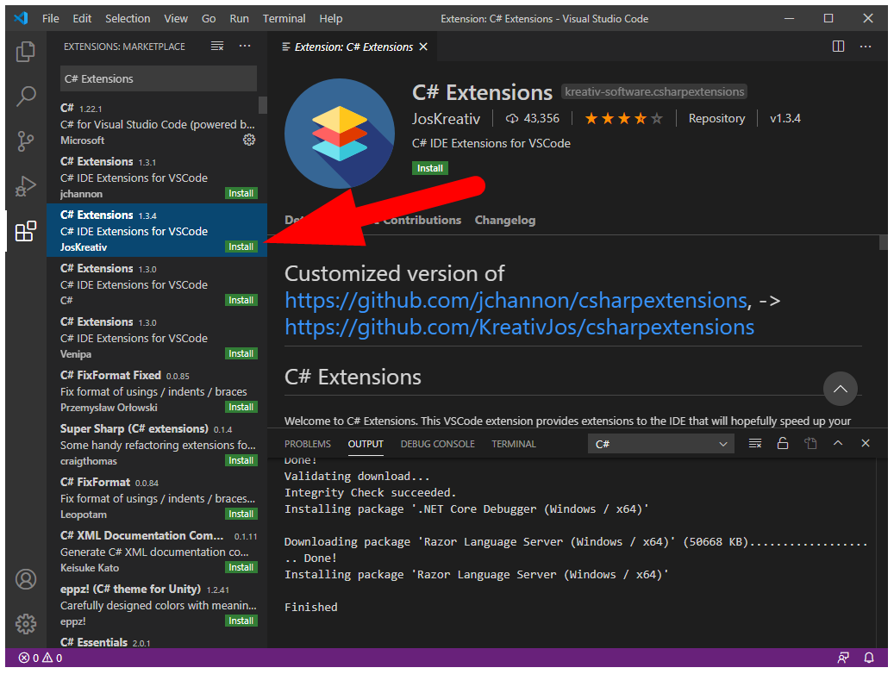

# Criando uma WebAPI com dotnet core e C#

## Parte 1 - Preparando o ambiente

Nesta etapa será feita a preparação do ambiente de desenvolvimento.

Serão instalados:
   - Visual Studio Code (VSCode)
   - SDK do dotnet core
   - Extenções/Plugins do C# no VSCode

Existe algumas IDEs (Integrated Development Environment) para desenvolvimento em dotnet core e C#.

> A opção **mais recomendada é o Visual Studio 2019**. (a versão Community é gratuíta!!!)
> Não vamos utilizar esta opção neste tutorial, pois o download/instalação da ferramenta pode consumir um tempo razoável.
> Consulte [este link](https://docs.microsoft.com/pt-br/visualstudio/install/install-visual-studio?view=vs-2019) caso queira instalar o Visual Studio 2019.

Neste tutorial, vamos utilizar o Visual Studio Code que é uma excetente opção como IDE de desenvolvimento, não só para dotnet core e C# com para outras linguagens também.

---
### Instalando o Visual Studio Code (VSCode)

Baixe a versão estável (Stable Build) do site [https://code.visualstudio.com/](https://code.visualstudio.com/) e execute a instalação.

> **Dica** - Marque as opções **"Open with Code"** durante a instalação.
> 

---
### Instalando o SDK (Software Development Kit) do dotnet core

Baixe a versão: **.NET Core 3.1 0 -> Download .NET Core SDK** do site [https://dotnet.microsoft.com/download](https://dotnet.microsoft.com/download) e execute a instalação.

Verifique a instalação executando o comando a seguir na linha de comando do Windows:

---
### Instalando os Plugins do C# no VSCode

**Instalando o Plugin C#**

Este plugin permitirá o desenvolvimento de projetos em dotnet Core e C# utilizando o VSCode.

 - Execute o VSCode;
 - Clique no Menu Extensions localizado no lado esquerdo do VSCode;
 - Procure pela extensão **C#** e instale-a;
   
 - Durante a instalação, serão baixados alguns pacotes, portanto aguarde o fim da instalação.
   
   

**Instalando o Plugin C# Extensions**

Este plugin facilitará a criação de novas Classes e Interfaces C# com o VSCode.

 - Clique no Menu Extensions localizado no lado esquerdo do VSCode;
 - Procure pela extensão **C# Extensions** e instale-a;
   

---
### Referências
 
 - [Instalação Visual Studio 2019](https://docs.microsoft.com/pt-br/visualstudio/install/install-visual-studio?view=vs-2019)
 - [Visual Studio Code](https://code.visualstudio.com)
 - [SDK .NET Core](https://dotnet.microsoft.com/download)
 - [Criando classes e interfaces com C# Extensions](https://medium.com/@renato.groffe/net-core-visual-studio-code-criando-rapidamente-classes-e-interfaces-com-c-extensions-e73bad83e867)
