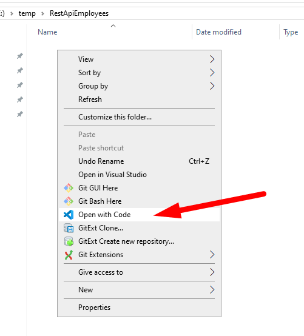
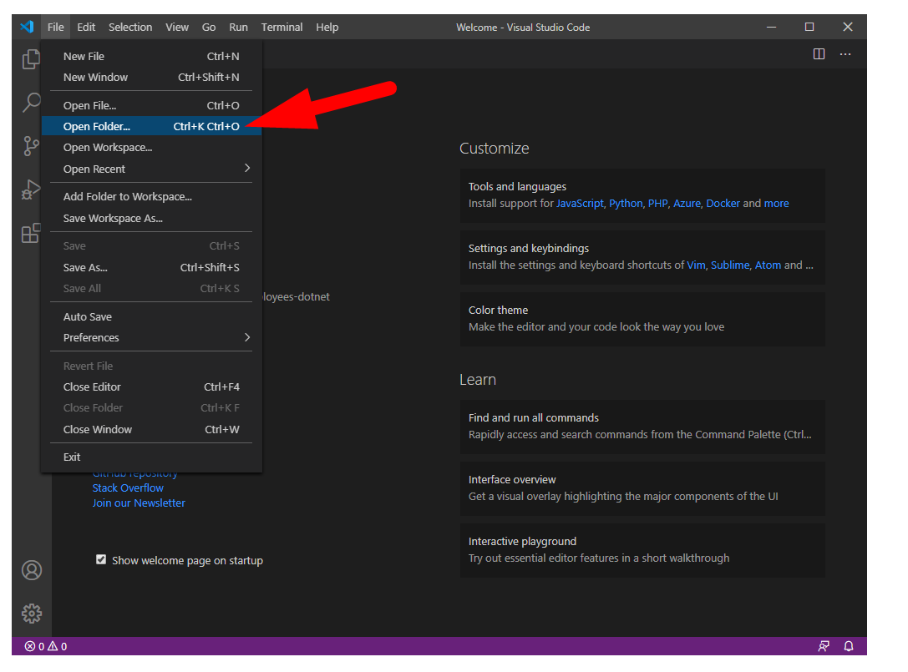

# Criando uma WebAPI com dotnet core e C#

## Parte 2 - Criando a WebAPI

Nesta etapa será implementada uma WebAPI simples, utilizando dotnet core e C#.


---
### Resultado esperado

Será criada uma WebAPI muito simples para cadastro de Empregados.

As operações esperadas na WebAPI são:

 - GET /api/employees -> lista todos os empregados cadastrados
 - GET /api/employees/:id -> busca um empregado cadastrado, pelo id
 - POST /api/employees -> cadastra um novo empregado
 - PUT  /api/employees/:id -> atualiza os dados de um empregado já cadastrado
 - DELETE /api/employees/:id -> excluir um empregado cadastrado

**[Acesse a documentação completa da API, para mais detalhes](https://employees38.docs.apiary.io/)**


---
### Criando o projeto

#### Criando a estrutura básica do projeto

- Crie um novo diretório para o seu projeto e abra o VSCode neste diretório
  > Abrindo VSCode pelo menu de contexto do Windows
  > 
  > Ou abrindo diretorio pelo VSCode
  > 
- [Abra o terminal integrado no VSCode](https://code.visualstudio.com/docs/editor/integrated-terminal) - pressionando **Ctrl + Shift + '** (aspas está ao lado da tecla 1)
  > 
- No terminal, digite os comando para criar uma nova WebAPI com dotnet core:
  ```console
  dotnet new webapi
  ```
- Os arquivos do projeto serão criados automaticamente:
  > 

#### Criando a entidade Employee
 
 - 


---
### Referências
 
 - [Documentando APIs com apiary.io](https://apiary.io/)
 - [Terminal integrado no VSCode](https://code.visualstudio.com/docs/editor/integrated-terminal)
