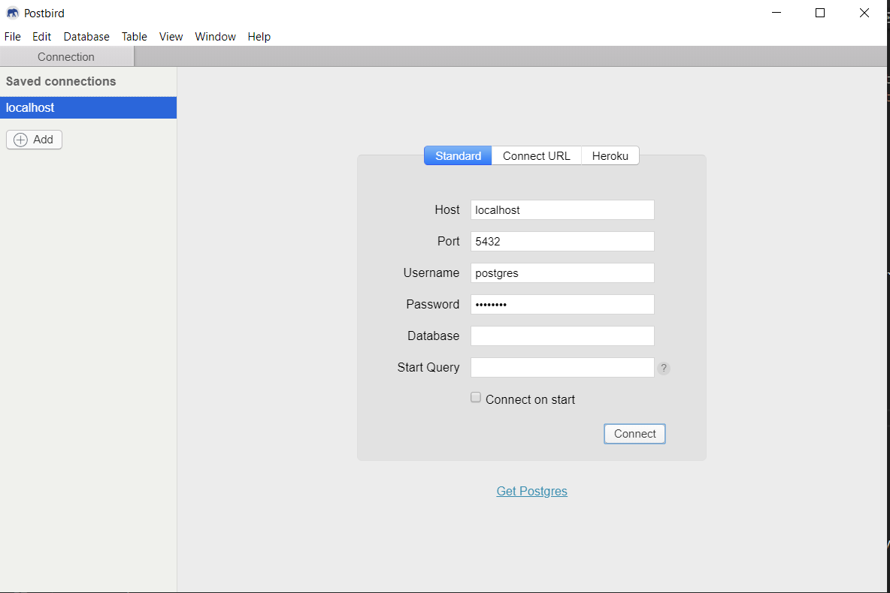
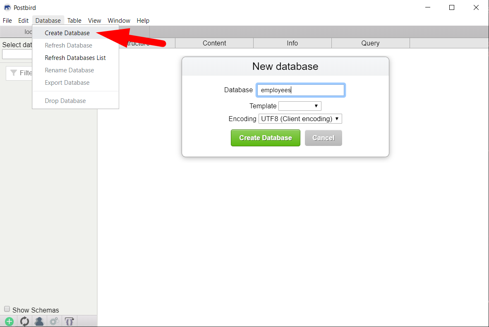

# Criando uma WebAPI com dotnet core e C#

## Parte 3 - Persistindo os dados no banco de dados PostgreSQL

Nesta etapa vamos persistir os dados dos empregados no banco de dados PostgreSQL, utilizando SQL Ansi.
Na próxima etapa vamos utilizar o PostgreeSQL com EntityFramework.

Será implementado uma nova classe para a interface ```IEmployeesRepository``` que salva os dados no Postgre.


---
### Instalação do PostgreSQL

Você pode instalar o PostgreSQL no seu Windows ou instalar o **docker** e rodar o PostgreSQL pelo docker.

**Instalação nativa no Windows**

- Baixe e instale o PostgreSQL - [https://www.postgresql.org/](https://www.postgresql.org/)

**Rodar pelo docker**

- Instale o docker para o Windows
  - Acesse o link [de download do Docker](https://hub.docker.com/editions/community/docker-ce-desktop-windows/) e clique no botão **Get Docker**
  - Utilize a opção Linux, quando solicitado
- Após instalado, execute os comando para rodar um container do PostgreSQL:
  ```console
  docker run --name postgres -e POSTGRES_PASSWORD=postgres -d postgres
  ```
  > Para confirmar que o serviço está rodando, execute: ```docker ps``` e verifique se o container postgres foi listado.
  > Após rodar o container a primeira vez, para inicar o serviço novamente basta executar o comando: ```docker start postgres```


---
### Instalação de um Client para o PostgreSQL

Um software cliente para fazer consultas SQL no PostgreSQL será necessário.

A recomendação neste tutorial é utilizar o **Postbird**.

- entre no link [https://github.com/Paxa/postbird/releases](https://github.com/Paxa/postbird/releases) e baixe a versão para Windows mais atual


---
### Preparando o banco de dados

- Conectar no banco de dados:
  
- Criando uma nova Database: **employees**
  
- Selecione o banco criado **employees** e clique na aba **Query** para executar o script de criação da tabela **employees**
  ```sql
  create table employees (
    id SERIAL primary key not null,
    name varchar(255) not null,
    salary numeric(10,2),
    age int,
    profile_image varchar(255)
  )
  ```


---
### Adicionando o pacote do Npgsql

- Na linha de comando no diretório raiz da aplicação, execute:
  ```console
  dotnet add package npgsql
  ```
  Aguarde a instalação.


---
### Criando a classe EmployeesRepositorySQL

Entre com a linha de comando no diretório raiz da aplicação (sugestão no tutorial anterior foi c:\temp\RestApiEmployees).

- Organizando diretórios da aplicação:
  ```console
  mkdir Persistence\PostgreSQL
  ```
- Crie a interface EmployeesRepositorySQL dentro do diretório Persistence\PostgreSQL:
  ```csharp
  using System;
  using System.Collections.Generic;
  using Microsoft.Extensions.Configuration;
  using Npgsql;
  using RestApiEmployees.Domain.Interfaces;
  using RestApiEmployees.Domain.Models;
  namespace RestApiEmployees.Persistence.PostgreSQL
  {
      public class EmployeesRepositorySQL : IEmployeesRepository
      {
          private string connString;

          public EmployeesRepositorySQL(IConfiguration config)
          {
              connString = config.GetConnectionString("postgresql");
          }

          public List<Employee> ListAll()
          {
              using var conn = Connection();
              try
              {
                  using var cmd = new NpgsqlCommand("select id, name, salary, age, profile_image from employees", conn);
                  using var reader = cmd.ExecuteReader();
                  var result = new List<Employee>();
                  while (reader.Read())
                  {
                      var employee = GetEmployee(reader);
                      result.Add(employee);
                  }
                  return result;
              }
              finally
              {
                  conn.Close();
              }
          }

          public Employee GetById(int id)
          {
              using var conn = Connection();
              try
              {
                  using var cmd = new NpgsqlCommand("select id, name, salary, age, profile_image from employees where id=@id", conn);
                  cmd.Parameters.AddWithValue("id", id);
                  using var reader = cmd.ExecuteReader();
                  var result = new List<Employee>();
                  if (reader.Read())
                      return GetEmployee(reader);
                  return null;
              }
              finally
              {
                  conn.Close();
              }
          }

          public void Add(Employee employee)
          {
              using var conn = Connection();
              try
              {
                  using var cmd = new NpgsqlCommand("insert into employees (name, salary, age, profile_image) values (@name, @salary, @age, @profile_image) RETURNING id", conn);
                  cmd.Parameters.AddWithValue("name", employee.Name);
                  cmd.Parameters.AddWithValue("salary", GetValueOrDBNull(employee.Salary));
                  cmd.Parameters.AddWithValue("age", GetValueOrDBNull(employee.Age));
                  cmd.Parameters.AddWithValue("profile_image", GetValueOrDBNull(employee.ProfileImage));
                  using var reader = cmd.ExecuteReader();
                  var result = new List<Employee>();
                  while (reader.Read())
                  {
                      var id = reader.GetInt32(0);
                      employee.Id = id;
                  }
              }
              finally
              {
                  conn.Close();
              }
          }

          public void DeleteById(int id)
          {
              using var conn = Connection();
              try
              {
                  using var cmd = new NpgsqlCommand("delete from employees where id=@id", conn);
                  cmd.Parameters.AddWithValue("id", id);
                  cmd.ExecuteNonQuery();
              }
              finally
              {
                  conn.Close();
              }
          }

          public void Update(Employee employee)
          {
              using var conn = Connection();
              try
              {
                  using var cmd = new NpgsqlCommand("update employees set name=@name, salary=@salary, age=@age, profile_image=@profile_image where id=@id", conn);
                  cmd.Parameters.AddWithValue("id", employee.Id);
                  cmd.Parameters.AddWithValue("name", employee.Name);
                  cmd.Parameters.AddWithValue("salary", GetValueOrDBNull(employee.Salary));
                  cmd.Parameters.AddWithValue("age", GetValueOrDBNull(employee.Age));
                  cmd.Parameters.AddWithValue("profile_image", GetValueOrDBNull(employee.ProfileImage));
                  cmd.ExecuteNonQuery();
              }
              finally
              {
                  conn.Close();
              }
          }

          private NpgsqlConnection Connection()
          {
              var conn = new NpgsqlConnection(connString);
              conn.Open();
              return conn;
          }

          private object GetValueOrDBNull(object value)
          {
              return value ?? DBNull.Value;
          }

          private Employee GetEmployee(NpgsqlDataReader reader)
          {
              var id = reader.GetInt32(0);
              var name = reader.GetString(1);
              var salary = reader.GetValue(2) as decimal?;
              var age = reader.GetValue(3) as int?;
              var profileImage = reader.GetValue(4) as string;
              var employee = new Employee(id, name, salary, age, profileImage);
              return employee;
          }
      }
  }
  ```


#### Incluindo a StringConnection do banco PostgreSQL no appsettings.json

- edite o arquivo appsettings.json, incluindo a ConnectionString do PostgreSQL
  ```json
  {
    "ConnectionStrings": {
      "postgresql": "Host=localhost;Username=postgres;Password=postgres;Database=employees"
    },
    "Logging": {
      "LogLevel": {
        "Default": "Information",
        "Microsoft": "Warning",
        "Microsoft.Hosting.Lifetime": "Information"
      }
    },
    "AllowedHosts": "*"
  }
  ```


#### Ajustando a classe Startup.cs, registrando as classes na injeção de dependência

- Altere o método ```ConfigureServices(IServiceCollection services)``` da classe ```Startup.cs```:
  ```csharp
  public void ConfigureServices(IServiceCollection services)
  {
      services.AddScoped<IEmployeesService, EmployeesService>();
      services.AddSingleton<IEmployeesRepository, EmployeesRepositorySQL>();
      services.AddControllers();
  }
  ```

#### Execute a aplicação

Nesta etapa vamos compilar e executar a aplicação:

- Para executar a aplicação, basta executar na linha de comando:
  ```csharp
  dotnet run
  ```

#### Testando a aplicação com o Postman

Para testar os endpoints da aplicação, vamos utilizar o Postman.

Em paralelo, execute os comandos SQL no Postird para verificar que os dados foram persistidos no banco.


---
### Referências
 - [Docker](https://hub.docker.com/editions/community/docker-ce-desktop-windows/)
 - [Docker](https://docs.docker.com/docker-for-windows/install-windows-home/)
 - [PostgreSQL no Docker](https://hub.docker.com/_/postgres)
 - [PostgreSQL com dotnet](https://www.npgsql.org/)
 
